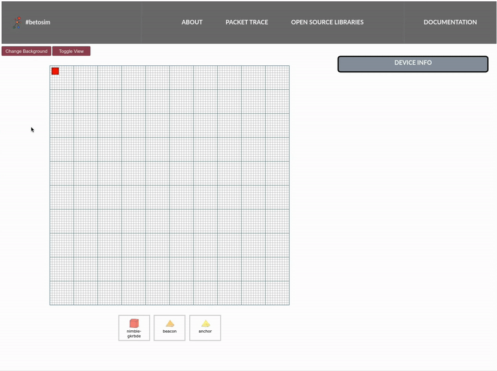
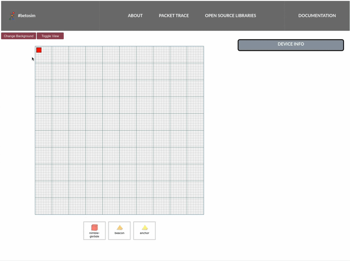
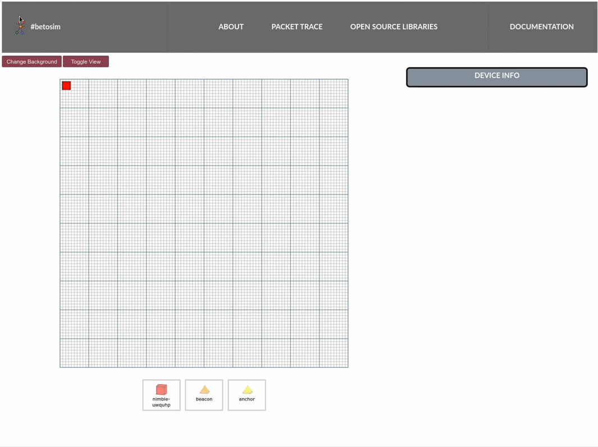
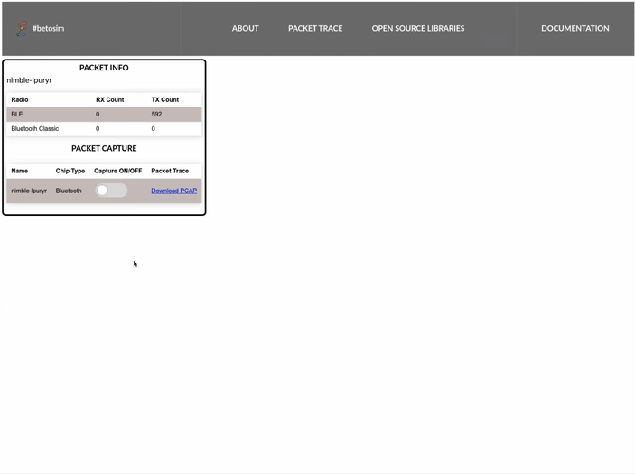

# Web User Interface

The `netsim` web user interface tool is used to interactively control the simulated network.

## Getting Started

To launch the web UI, you can either launch from command line interface or directly access [localhost:7681](http://localhost:7681)

```sh
netsim gui
```

## Moving Devices in 2D plane

<br><br>
1. Click on the device you wish to move.
2. Drag and drop the device to your desired location.
3. See the **Position** updates on the **Device Info** panel on the right.

## Changing Device Orientation

<br><br>
1. Click on the device you wish to change orientation.
2. On the **Device Info** panel, change the **Orientation** by moving around the range inputs.
3. See the orientation updates on the device sprite.

## Toggling Radio State

<br><br>
1. Click on the device you wish to change radio state.
2. On the **Device Info** panel, toggle a chip under **Radio States**

## Changing Backgrounds

<br><br>
1. On the left top, Click **Change Backgrounds** button.

## Toggling View to Orthographic View

<br><br>
1. On the left top, click **Toggle View** button.

## Moving Devices in 3d space

We do not provide interactive control feature for 3d space yet.
But the information panel allows you to edit positions.

<br><br>
1. Click on the device you wish to move.
2. On the **Device Info** panel, click **Edit**.
3. Change **Z** value in **Position** to shift heights.
4. Click **Save**

## Changing to Packet Trace View

<br><br>
1. On the navigation bar on top, click **Packet Trace**.

## Toggling Packet Capture and Downloading pcap

<br><br>
1. On the navigation bar on top, click **Packet Trace**.
2. Toggle **Capture ON/OFF** to turn capture on.
3. Toggle **Capture ON/OFF** to turn capture off.
4. Click **Download**.
5. Open the downloaded file with pcap viewer (preferably [Wireshark](https://www.wireshark.org)).


